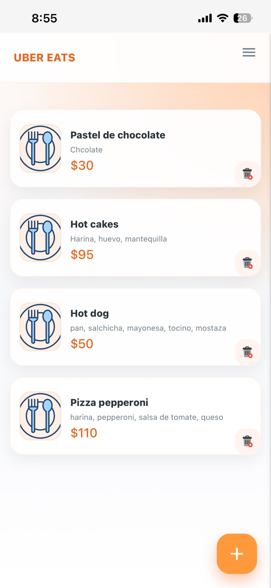
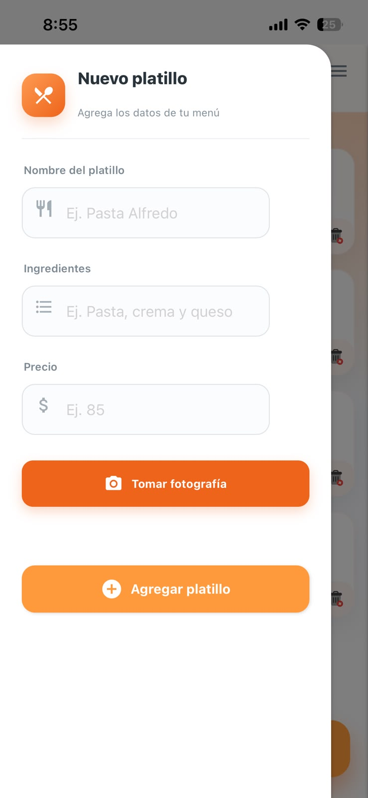
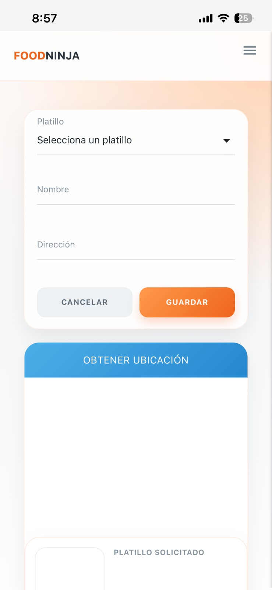
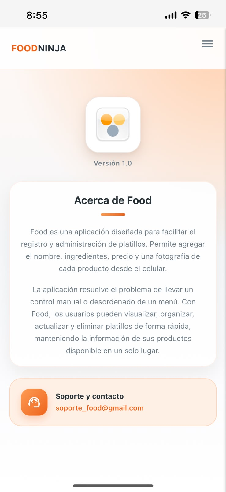

# UBEREATSCUDEC

## Aplicación web progresiva (PWA).
**UberEatsCUDEC** es una aplicación web progresiva orientada a la gestión de platillos, y realización de pedidos.
La aplicación permite registrar productos, agregar fotografías mediante la camara del dispositivo, consultar el menú y gestionar pedidos mediante una interfaz adaptable a dispositivos móviles.

**Materia:** Taller de programación avanzada  
**Carrera:** Ingeniería en Sistemas Computacionales  
**Alumno:** Rodrigo Arvisu  
**Institución:** Universidad Multicultural CUDEC  
**Tipo de aplicación:** Progressive Web App (PWA)

## Descripción del proyecto 
UberEatsCUDEC es una aplicación web desarrollada para facilitar la administración de un menú de alimentos y la realización de pedidos.

La aplicación permite registrar platillos proporcionando información como nombre, ingredientes, precio y fotografía. También permite visualizar los productos registrados y eliminarlos cuando sea necesario.

Además, cuenta con un módulo para realizar pedidos en el cual el usuario puede seleccionar un platillo, proporcionar su nombre y dirección, obtener su ubicación mediante el dispositivo y visualizar información relacionada con el pedido.

La aplicación fue desarrollada como una Progressive Web App (PWA), permitiendo que pueda utilizarse desde dispositivos móviles y computadoras mediante un navegador web.

## Objetivos 

### Objetivo general
Desarrollar una aplicación web progresiva que permita gestionar un catálogo de platillos y facilitar la realización de pedidos mediante una interfaz intuitiva, adaptable a dispositivos móviles y con integración de servicios web.

### Objetivos específicos

- Diseñar una interfaz gráfica intuitiva y adaptable a diferentes dispositivos.
- Permitir el registro de nuevos platillos.
- Registrar información como nombre, ingredientes y precio.
- Permitir capturar fotografías utilizando la cámara del dispositivo.
- Mostrar los platillos registrados en el menú principal.
- Permitir eliminar platillos del catálogo.
- Implementar un módulo para realizar pedidos.
- Obtener la ubicación del usuario mediante geolocalización.
- Mostrar la ubicación mediante un mapa.
- Generar información identificativa del pedido mediante un código QR.
- Implementar una base de datos en la nube para almacenar la información.
- Incorporar características de una Progressive Web App.

### Características principales

La aplicación cuenta con las siguientes funcionalidades:

### Gestión de platillos

- Registro de nuevos platillos.
- Captura del nombre del platillo.
- Registro de ingredientes.
- Registro del precio.
- Captura de fotografías mediante la cámara del dispositivo.
- Visualización de fotografías de los platillos.
- Visualización del catálogo de platillos.
- Eliminación de platillos.

### Gestión de pedidos

- Selección de platillos disponibles.
- Registro del nombre del cliente.
- Registro de la dirección.
- Obtención de la ubicación del usuario.
- Visualización de la ubicación mediante un mapa interactivo.
- Generación de código QR relacionado con el pedido.
- Visualización de la información del platillo solicitado.

### Tecnologías utilizadas

| Tecnología | Uso |
|---|---|
| HTML5 | Estructura de las páginas |
| CSS3 | Diseño y estilos de la aplicación |
| JavaScript | Lógica e interacción de la aplicación |
| Firebase | Servicios de backend y base de datos |
| Service Worker | Funcionalidades PWA |
| Web App Manifest | Configuración de la aplicación instalable |
| Leaflet | Visualización del mapa y ubicación |
| QR Code | Generación de código QR para pedidos |
| Git | Control de versiones |
| GitHub | Repositorio y alojamiento del proyecto |

### Estructura del proyecto

La estructura principal del proyecto se organiza de la siguiente manera:

```text
UberEatsCUDEC/
│
├── css/
│   ├── materialize.min.css
│   └── styles.css
│
├── js/
│   ├── materialize.min.js
│   ├── firebase.js
│   ├── db.js
│   └── index.js
│
├── pages/
│   ├── about.html
│   ├── pedidos.html
│   └── contact.html
│
├── img/
│   ├── iconos/
│   └── ...
│
├── index.html
├── manifest.json
├── sw.js
└── README.md

```
## Capturas de pantalla

### 🏠 Inicio


### 🍽️ Registro de platillo


### 📍 Realizar pedido


### ℹ️ Acerca



